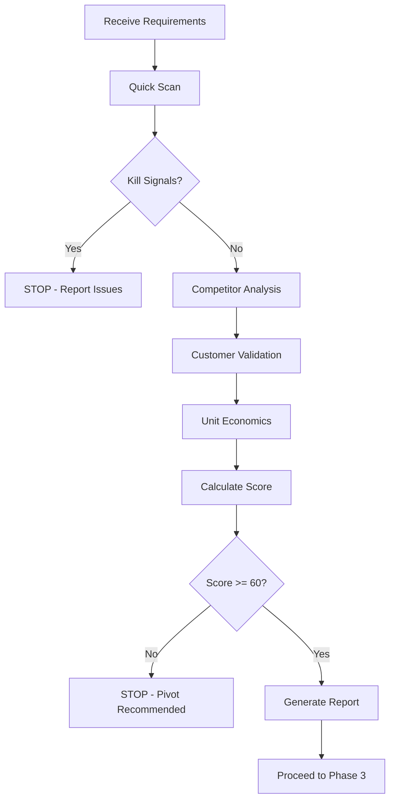
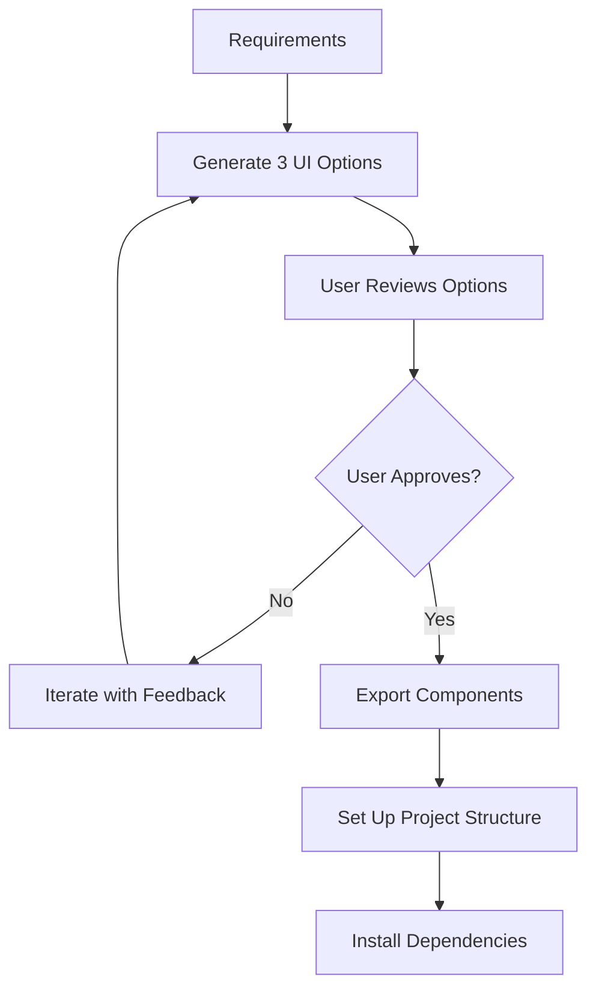
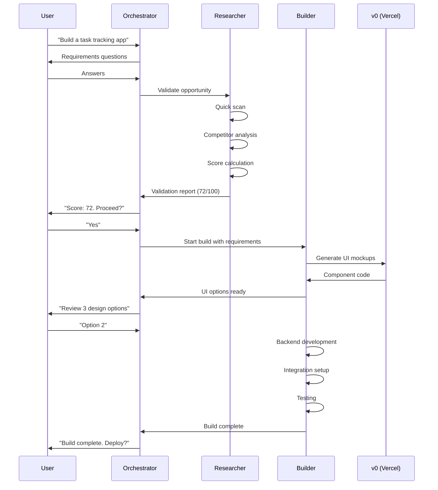

# Build App Workflow
## Complete Guide to Autonomous App Construction

**Version**: 4.0
**Duration**: 2-6 hours (depending on complexity)
**Agents Involved**: Orchestrator, Researcher, Builder

---

## WORKFLOW OVERVIEW

```
┌─────────────────────────────────────────────────────────────────────────┐
│                        BUILD APP WORKFLOW                                │
├─────────────────────────────────────────────────────────────────────────┤
│                                                                          │
│  Phase 1          Phase 2           Phase 3          Phase 4             │
│  ┌─────┐          ┌─────┐           ┌─────┐          ┌─────┐            │
│  │ REQ │ ───────> │ VAL │ ───────>  │ UI  │ ───────> │ DEV │            │
│  └─────┘          └─────┘           └─────┘          └─────┘            │
│  30 min           45 min            60 min           90 min              │
│                                                                          │
│  Phase 5          Phase 6           Phase 7                              │
│  ┌─────┐          ┌─────┐           ┌─────┐                             │
│  │ INT │ ───────> │ QA  │ ───────>  │HAND │ ───────> DEPLOY             │
│  └─────┘          └─────┘           └─────┘                             │
│  45 min           30 min            15 min                               │
│                                                                          │
│  TOTAL ESTIMATED TIME: 5-6 hours                                         │
└─────────────────────────────────────────────────────────────────────────┘
```

---

## PREREQUISITES

### Required API Keys

```yaml
required_keys:
  - name: ANTHROPIC_API_KEY
    purpose: Claude Code operations
    get_from: https://console.anthropic.com

  - name: V0_API_KEY
    purpose: UI component generation
    get_from: https://v0.dev/settings

  - name: CLERK_SECRET_KEY
    purpose: Authentication
    get_from: https://dashboard.clerk.com

  - name: STRIPE_SECRET_KEY
    purpose: Payment processing
    get_from: https://dashboard.stripe.com

  - name: DATABASE_URL
    purpose: Database connection
    get_from: Neon/Supabase/PlanetScale

  - name: VERCEL_TOKEN
    purpose: Deployment
    get_from: https://vercel.com/account/tokens
```

### Required Tools

```bash
# Verify installations
node --version          # >= 18.0.0
npm --version           # >= 9.0.0
git --version           # >= 2.0.0
claude --version        # Claude Code installed

# Optional but recommended
pnpm --version          # Faster package management
vercel --version        # Vercel CLI
```

### Environment Setup

```bash
# Create .env.local template
cat > .env.local.template << 'EOF'
# Authentication (Clerk)
NEXT_PUBLIC_CLERK_PUBLISHABLE_KEY=
CLERK_SECRET_KEY=

# Database
DATABASE_URL=

# Payments (Stripe)
NEXT_PUBLIC_STRIPE_PUBLISHABLE_KEY=
STRIPE_SECRET_KEY=
STRIPE_WEBHOOK_SECRET=

# Analytics (PostHog)
NEXT_PUBLIC_POSTHOG_KEY=
NEXT_PUBLIC_POSTHOG_HOST=

# Email (Resend)
RESEND_API_KEY=

# App
NEXT_PUBLIC_APP_URL=http://localhost:3000
EOF
```

---

## PHASE 1: REQUIREMENTS GATHERING
**Duration**: 20-30 minutes
**Agent**: Orchestrator (direct interaction)

### Questions to Ask User

The orchestrator will ask these questions to understand the app:

```yaml
required_questions:
  1_problem:
    question: "In one sentence, what problem does this app solve?"
    validation: "Must be specific and actionable"
    example_good: "Helps freelancers track time and auto-generate invoices"
    example_bad: "Makes life easier for people"

  2_target_user:
    question: "Who exactly would pay for this? Be very specific."
    validation: "Must identify a clear persona"
    example_good: "Solo freelance graphic designers earning $50-150k/year"
    example_bad: "Anyone who needs it"

  3_price_point:
    question: "How much would they pay per month?"
    options: [9, 19, 29, 49, 99]
    guidance: "If unsure, researcher agent will recommend based on market"

  4_killer_feature:
    question: "What's the ONE thing this app must do perfectly?"
    validation: "Single, clear feature"
    example_good: "One-click invoice generation from time entries"
    example_bad: "Everything should work well"

  5_current_solutions:
    question: "What tools are people using today for this?"
    purpose: "Helps researcher analyze competitors"
    example: "They use spreadsheets, Toggl, and Harvest"

  6_design_preferences:
    question: "Any design preferences?"
    options:
      - "Dark mode / Light mode / Both"
      - "Color preferences"
      - "Similar apps you like the look of"
    default: "Modern, clean, shadcn/ui defaults"
```

### Technical Questions (If Needed)

```yaml
technical_questions:
  7_authentication:
    question: "Do users need to log in?"
    impact:
      yes: "Adds Clerk auth, database for user data"
      no: "Simpler, faster build, limited features"

  8_mobile:
    question: "Does it need to work well on phones?"
    impact:
      yes: "Mobile-first responsive design, PWA"
      no: "Desktop-optimized, simpler CSS"

  9_integrations:
    question: "Any third-party integrations needed?"
    common:
      - "Stripe (payments)"
      - "Google Calendar"
      - "Slack notifications"
      - "Email sending"

  10_hosting:
    question: "Where do you want it hosted?"
    options:
      - name: "Vercel"
        cost: "Free tier, then $20/mo"
        recommendation: "Best for Next.js"
      - name: "Railway"
        cost: "$5/mo minimum"
        recommendation: "Good for full-stack"
      - name: "Self-hosted"
        cost: "VPS ~$5-20/mo"
        recommendation: "Advanced users only"
```

### Requirements Document Output

```markdown
# App Requirements: {APP_NAME}

## Summary
- **Problem**: {one sentence}
- **Target User**: {specific persona}
- **Price Point**: ${X}/month
- **Core Feature**: {killer feature}

## Technical Requirements
- Authentication: {Yes/No}
- Mobile Support: {Yes/No}
- Integrations: {list}
- Hosting: {platform}

## Design Requirements
- Theme: {dark/light/both}
- Colors: {preferences}
- Reference Apps: {list}

## Success Criteria
- MVP must include: {features}
- Nice-to-have: {features}
- Explicitly excluded: {features}

---
Generated: {timestamp}
Phase 1 Duration: {X} minutes
```

---

## PHASE 2: MARKET VALIDATION
**Duration**: 30-45 minutes
**Agent**: Researcher

### Validation Process



### Quick Scan Checklist (5 minutes)

```yaml
quick_scan:
  checks:
    - "Is the problem clearly defined?"
    - "Are people actively complaining about this?"
    - "Do paid solutions already exist?"
    - "Can we build MVP in < 2 weeks?"
    - "Is target market reachable online?"

  kill_signals:
    - "Requires hardware"
    - "Requires regulatory approval (healthcare, finance)"
    - "No evidence anyone pays for this"
    - "Market dominated by free, well-funded tools"
    - "Technical moat we cannot overcome"
    - "Requires real-time data we can't access"

  proceed_if:
    - "At least 4/5 checks pass"
    - "Zero kill signals present"
```

### Competitor Analysis (15 minutes)

```python
# Automated competitor research
competitor_analysis:
  search_queries:
    - "{problem} software"
    - "{problem} app"
    - "best {problem} tool"
    - "{problem} alternative"

  for_each_competitor:
    - name
    - url
    - pricing_tiers
    - key_features
    - user_reviews (focus on complaints)
    - estimated_traffic
    - years_in_market
    - funding_status

  output:
    - competitor_matrix
    - price_range (min, max, median)
    - common_features (table stakes)
    - gaps_and_opportunities
    - differentiation_angles
```

### Customer Validation (15 minutes)

```yaml
customer_validation:
  reddit_search:
    subreddits:
      - "r/SaaS"
      - "r/{niche}"
      - "r/smallbusiness"
    queries:
      - "{competitor} sucks"
      - "frustrated with {problem}"
      - "looking for {solution}"

  review_mining:
    sources:
      - G2
      - Capterra
      - ProductHunt
      - App Store
    focus:
      - "1-3 star reviews"
      - "Feature requests"
      - "Pricing complaints"

  output:
    - validated_pain_points
    - feature_requests
    - price_sensitivity
    - urgency_score (1-10)
```

### Unit Economics (10 minutes)

```yaml
unit_economics:
  calculate:
    target_mrr: 10000
    price_point: ${user_specified}
    customers_needed: target_mrr / price_point

  estimate:
    cac: "Based on channel + competition"
    conversion_rate: "Based on price point"
    churn_rate: "Based on category"
    ltv: price_point / churn_rate

  feasibility:
    ltv_cac_ratio: "Must be > 3:1"
    traffic_needed: customers_needed / conversion_rate
    time_to_10k: "Based on growth assumptions"
```

### Validation Score (0-100)

```yaml
scoring:
  market_size: 25
    criteria:
      25: "1M+ potential users, clear B2B need"
      20: "500k+ users, strong niche"
      15: "100k+ users, growing market"
      10: "50k+ users, stable"
      5: "<50k users or unclear"

  willingness_to_pay: 25
    criteria:
      25: "Competitors charge $50+/mo, users complain about price"
      20: "Competitors $20-50/mo, active market"
      15: "Some paid tools, free dominates"
      10: "Mostly free tools exist"
      5: "No evidence of payment"

  competition_gap: 20
    criteria:
      20: "Clear gap (UX, price, features)"
      15: "Leaders have exploitable weakness"
      10: "Crowded but differentiation possible"
      5: "Very crowded, unclear angle"
      0: "Dominated by well-funded players"

  build_complexity: 15
    criteria:
      15: "Simple CRUD, < 1 week MVP"
      12: "Moderate, 1-2 weeks"
      8: "Complex, 2-4 weeks"
      4: "Significant challenges"
      0: "Requires ML or 6+ weeks"

  distribution: 15
    criteria:
      15: "Clear SEO + community access"
      12: "Strong SEO OR community"
      8: "Moderate organic potential"
      4: "Mostly paid acquisition"
      0: "No clear path to customers"

  thresholds:
    proceed: ">= 60"
    strong: ">= 80"
    weak: "50-59"
    pass: "< 50"
```

### Validation Output

```markdown
# Validation Report: {APP_NAME}

## Score: {X}/100 - {RECOMMENDATION}

### Breakdown
| Category | Score | Max | Notes |
|----------|-------|-----|-------|
| Market Size | X | 25 | {notes} |
| Willingness to Pay | X | 25 | {notes} |
| Competition Gap | X | 20 | {notes} |
| Build Complexity | X | 15 | {notes} |
| Distribution | X | 15 | {notes} |
| **TOTAL** | **X** | **100** | |

### Competitors
| Name | Price | Strength | Weakness | Our Angle |
|------|-------|----------|----------|-----------|
| ... | ... | ... | ... | ... |

### Unit Economics
- Customers needed for $10k MRR: {X}
- Estimated CAC: ${X}
- Estimated LTV: ${X}
- LTV:CAC Ratio: {X}:1
- Traffic needed/month: {X}
- Feasibility: {HIGH/MEDIUM/LOW}

### Go/No-Go Recommendation
{Detailed recommendation with reasoning}

---
Generated: {timestamp}
Phase 2 Duration: {X} minutes
```

---

## PHASE 3: UI DESIGN
**Duration**: 45-60 minutes
**Agent**: Builder (frontend_builder subagent)
**Tool**: Vercel v0

### Design Process



### UI Generation Prompts

```javascript
// v0 prompt template
const generateUIPrompt = (appName, requirements, designPrefs) => `
Create a complete UI for ${appName} with these screens:

Core Screens:
1. Landing/Marketing page
2. Sign up / Sign in
3. Main dashboard
4. Core feature screen: ${requirements.killerFeature}
5. Settings/Profile
6. Pricing page

Requirements:
- ${requirements.mobile ? 'Mobile-first responsive design' : 'Desktop-optimized'}
- ${designPrefs.theme} theme support
- Color scheme: ${designPrefs.colors || 'Modern neutral with accent'}
- Use shadcn/ui components only
- Tailwind CSS only, no custom CSS files
- Include loading states
- Include empty states
- Include error states

Reference style: ${designPrefs.references || 'Linear, Vercel, Stripe'}

Make it feel premium but not over-designed.
`;
```

### Component Organization

```
src/
├── components/
│   ├── ui/                    # shadcn/ui base components
│   │   ├── button.tsx
│   │   ├── card.tsx
│   │   ├── input.tsx
│   │   └── ...
│   ├── marketing/             # Landing page components
│   │   ├── hero.tsx
│   │   ├── features.tsx
│   │   ├── pricing.tsx
│   │   ├── testimonials.tsx
│   │   └── footer.tsx
│   ├── dashboard/             # App components
│   │   ├── sidebar.tsx
│   │   ├── header.tsx
│   │   ├── stats-cards.tsx
│   │   └── {feature}-view.tsx
│   ├── auth/                  # Auth components
│   │   ├── sign-in-form.tsx
│   │   └── sign-up-form.tsx
│   └── shared/                # Shared components
│       ├── loading.tsx
│       ├── empty-state.tsx
│       └── error-boundary.tsx
```

### Design Review Checklist

```yaml
design_review:
  accessibility:
    - "Color contrast meets WCAG AA"
    - "All interactive elements have focus states"
    - "Form inputs have labels"
    - "Images have alt text placeholders"

  responsiveness:
    - "Works on 320px width"
    - "Works on 768px width"
    - "Works on 1440px width"
    - "Touch targets are 44px minimum"

  consistency:
    - "Consistent spacing system"
    - "Consistent typography scale"
    - "Consistent color usage"
    - "Consistent component patterns"

  performance:
    - "No layout shift"
    - "Skeleton loaders for async content"
    - "Optimistic UI where possible"
```

---

## PHASE 4: BACKEND DEVELOPMENT
**Duration**: 60-90 minutes
**Agent**: Builder (backend_builder, database_architect subagents)

### Project Setup

```bash
# 1. Create Next.js project
npx create-next-app@latest ${APP_NAME} \
  --typescript \
  --tailwind \
  --eslint \
  --app \
  --src-dir \
  --import-alias "@/*"

# 2. Install dependencies
cd ${APP_NAME}
npm install \
  @clerk/nextjs \
  @stripe/stripe-js stripe \
  @tanstack/react-query \
  drizzle-orm @neondatabase/serverless \
  zod \
  react-hook-form @hookform/resolvers \
  lucide-react \
  class-variance-authority clsx tailwind-merge \
  resend \
  posthog-js

# 3. Install dev dependencies
npm install -D \
  drizzle-kit \
  @types/node

# 4. Set up shadcn/ui
npx shadcn@latest init -y
npx shadcn@latest add button card input form toast dialog dropdown-menu avatar
```

### Database Schema Design

```typescript
// src/db/schema.ts
import { pgTable, text, timestamp, integer, uuid, boolean } from 'drizzle-orm/pg-core';

// Users (synced from Clerk)
export const users = pgTable('users', {
  id: uuid('id').primaryKey().defaultRandom(),
  clerkId: text('clerk_id').notNull().unique(),
  email: text('email').notNull(),
  name: text('name'),
  imageUrl: text('image_url'),
  createdAt: timestamp('created_at').defaultNow(),
  updatedAt: timestamp('updated_at').defaultNow()
});

// Subscriptions
export const subscriptions = pgTable('subscriptions', {
  id: uuid('id').primaryKey().defaultRandom(),
  userId: uuid('user_id').references(() => users.id).notNull(),
  stripeCustomerId: text('stripe_customer_id'),
  stripeSubscriptionId: text('stripe_subscription_id'),
  stripePriceId: text('stripe_price_id'),
  status: text('status').default('inactive'),
  plan: text('plan').default('free'),
  currentPeriodStart: timestamp('current_period_start'),
  currentPeriodEnd: timestamp('current_period_end'),
  cancelAtPeriodEnd: boolean('cancel_at_period_end').default(false),
  createdAt: timestamp('created_at').defaultNow(),
  updatedAt: timestamp('updated_at').defaultNow()
});

// App-specific tables added here based on requirements
// Example for a task app:
export const tasks = pgTable('tasks', {
  id: uuid('id').primaryKey().defaultRandom(),
  userId: uuid('user_id').references(() => users.id).notNull(),
  title: text('title').notNull(),
  description: text('description'),
  status: text('status').default('pending'),
  priority: integer('priority').default(0),
  dueDate: timestamp('due_date'),
  completedAt: timestamp('completed_at'),
  createdAt: timestamp('created_at').defaultNow(),
  updatedAt: timestamp('updated_at').defaultNow()
});
```

### API Route Templates

```typescript
// src/app/api/[resource]/route.ts - CRUD template
import { auth } from '@clerk/nextjs';
import { db } from '@/db';
import { resource, users } from '@/db/schema';
import { eq, and } from 'drizzle-orm';
import { NextResponse } from 'next/server';
import { z } from 'zod';

// Validation schema
const createSchema = z.object({
  title: z.string().min(1).max(200),
  // ... other fields
});

// GET - List resources
export async function GET(req: Request) {
  try {
    const { userId } = auth();
    if (!userId) {
      return NextResponse.json({ error: 'Unauthorized' }, { status: 401 });
    }

    const user = await db.query.users.findFirst({
      where: eq(users.clerkId, userId)
    });

    if (!user) {
      return NextResponse.json({ error: 'User not found' }, { status: 404 });
    }

    const items = await db.query.resource.findMany({
      where: eq(resource.userId, user.id),
      orderBy: (r, { desc }) => [desc(r.createdAt)]
    });

    return NextResponse.json(items);
  } catch (error) {
    console.error('GET /api/resource error:', error);
    return NextResponse.json({ error: 'Internal error' }, { status: 500 });
  }
}

// POST - Create resource
export async function POST(req: Request) {
  try {
    const { userId } = auth();
    if (!userId) {
      return NextResponse.json({ error: 'Unauthorized' }, { status: 401 });
    }

    const body = await req.json();
    const validated = createSchema.parse(body);

    const user = await db.query.users.findFirst({
      where: eq(users.clerkId, userId)
    });

    if (!user) {
      return NextResponse.json({ error: 'User not found' }, { status: 404 });
    }

    const [item] = await db.insert(resource).values({
      userId: user.id,
      ...validated
    }).returning();

    return NextResponse.json(item, { status: 201 });
  } catch (error) {
    if (error instanceof z.ZodError) {
      return NextResponse.json({ error: error.errors }, { status: 400 });
    }
    console.error('POST /api/resource error:', error);
    return NextResponse.json({ error: 'Internal error' }, { status: 500 });
  }
}
```

### Authentication Setup (Clerk)

```typescript
// src/middleware.ts
import { clerkMiddleware, createRouteMatcher } from '@clerk/nextjs/server';

const isProtectedRoute = createRouteMatcher([
  '/dashboard(.*)',
  '/api/((?!webhook).*)' // Protect all API except webhooks
]);

export default clerkMiddleware((auth, req) => {
  if (isProtectedRoute(req)) {
    auth().protect();
  }
});

export const config = {
  matcher: ['/((?!.*\\..*|_next).*)', '/', '/(api|trpc)(.*)'],
};
```

```typescript
// src/app/api/webhooks/clerk/route.ts
import { Webhook } from 'svix';
import { headers } from 'next/headers';
import { WebhookEvent } from '@clerk/nextjs/server';
import { db } from '@/db';
import { users } from '@/db/schema';
import { eq } from 'drizzle-orm';

export async function POST(req: Request) {
  const WEBHOOK_SECRET = process.env.CLERK_WEBHOOK_SECRET;

  if (!WEBHOOK_SECRET) {
    throw new Error('Missing CLERK_WEBHOOK_SECRET');
  }

  const headerPayload = headers();
  const svix_id = headerPayload.get('svix-id');
  const svix_timestamp = headerPayload.get('svix-timestamp');
  const svix_signature = headerPayload.get('svix-signature');

  if (!svix_id || !svix_timestamp || !svix_signature) {
    return new Response('Missing svix headers', { status: 400 });
  }

  const payload = await req.json();
  const body = JSON.stringify(payload);

  const wh = new Webhook(WEBHOOK_SECRET);
  let evt: WebhookEvent;

  try {
    evt = wh.verify(body, {
      'svix-id': svix_id,
      'svix-timestamp': svix_timestamp,
      'svix-signature': svix_signature,
    }) as WebhookEvent;
  } catch (err) {
    console.error('Webhook verification failed:', err);
    return new Response('Invalid signature', { status: 400 });
  }

  const eventType = evt.type;

  if (eventType === 'user.created') {
    const { id, email_addresses, first_name, last_name, image_url } = evt.data;

    await db.insert(users).values({
      clerkId: id,
      email: email_addresses[0]?.email_address || '',
      name: [first_name, last_name].filter(Boolean).join(' ') || null,
      imageUrl: image_url || null
    });
  }

  if (eventType === 'user.updated') {
    const { id, email_addresses, first_name, last_name, image_url } = evt.data;

    await db.update(users)
      .set({
        email: email_addresses[0]?.email_address || '',
        name: [first_name, last_name].filter(Boolean).join(' ') || null,
        imageUrl: image_url || null,
        updatedAt: new Date()
      })
      .where(eq(users.clerkId, id));
  }

  if (eventType === 'user.deleted') {
    const { id } = evt.data;
    if (id) {
      await db.delete(users).where(eq(users.clerkId, id));
    }
  }

  return new Response('Webhook processed', { status: 200 });
}
```

---

## PHASE 5: INTEGRATION
**Duration**: 30-45 minutes
**Agent**: Builder (all subagents)

### Stripe Integration

```typescript
// src/lib/stripe.ts
import Stripe from 'stripe';

export const stripe = new Stripe(process.env.STRIPE_SECRET_KEY!, {
  apiVersion: '2023-10-16',
  typescript: true,
});

export const PLANS = {
  free: {
    name: 'Free',
    price: 0,
    priceId: null,
    features: ['Feature 1', 'Feature 2', 'Limited usage']
  },
  pro: {
    name: 'Pro',
    price: 19,
    priceId: process.env.STRIPE_PRO_PRICE_ID,
    features: ['Everything in Free', 'Feature 3', 'Feature 4', 'Unlimited usage']
  },
  team: {
    name: 'Team',
    price: 49,
    priceId: process.env.STRIPE_TEAM_PRICE_ID,
    features: ['Everything in Pro', 'Feature 5', 'Team collaboration', 'Priority support']
  }
};
```

```typescript
// src/app/api/stripe/checkout/route.ts
import { auth } from '@clerk/nextjs';
import { stripe, PLANS } from '@/lib/stripe';
import { db } from '@/db';
import { users, subscriptions } from '@/db/schema';
import { eq } from 'drizzle-orm';
import { NextResponse } from 'next/server';

export async function POST(req: Request) {
  try {
    const { userId } = auth();
    if (!userId) {
      return NextResponse.json({ error: 'Unauthorized' }, { status: 401 });
    }

    const { priceId } = await req.json();

    const user = await db.query.users.findFirst({
      where: eq(users.clerkId, userId)
    });

    if (!user) {
      return NextResponse.json({ error: 'User not found' }, { status: 404 });
    }

    // Get or create Stripe customer
    let subscription = await db.query.subscriptions.findFirst({
      where: eq(subscriptions.userId, user.id)
    });

    let customerId = subscription?.stripeCustomerId;

    if (!customerId) {
      const customer = await stripe.customers.create({
        email: user.email,
        metadata: { userId: user.id, clerkId: userId }
      });
      customerId = customer.id;

      // Create subscription record
      await db.insert(subscriptions).values({
        userId: user.id,
        stripeCustomerId: customerId
      });
    }

    // Create checkout session
    const session = await stripe.checkout.sessions.create({
      customer: customerId,
      mode: 'subscription',
      payment_method_types: ['card'],
      line_items: [{ price: priceId, quantity: 1 }],
      success_url: `${process.env.NEXT_PUBLIC_APP_URL}/dashboard?success=true`,
      cancel_url: `${process.env.NEXT_PUBLIC_APP_URL}/pricing?canceled=true`,
      metadata: { userId: user.id }
    });

    return NextResponse.json({ url: session.url });
  } catch (error) {
    console.error('Checkout error:', error);
    return NextResponse.json({ error: 'Checkout failed' }, { status: 500 });
  }
}
```

```typescript
// src/app/api/webhooks/stripe/route.ts
import { stripe } from '@/lib/stripe';
import { db } from '@/db';
import { subscriptions } from '@/db/schema';
import { eq } from 'drizzle-orm';
import { headers } from 'next/headers';
import { NextResponse } from 'next/server';

export async function POST(req: Request) {
  const body = await req.text();
  const signature = headers().get('stripe-signature')!;

  let event;

  try {
    event = stripe.webhooks.constructEvent(
      body,
      signature,
      process.env.STRIPE_WEBHOOK_SECRET!
    );
  } catch (err) {
    console.error('Webhook signature verification failed:', err);
    return NextResponse.json({ error: 'Invalid signature' }, { status: 400 });
  }

  switch (event.type) {
    case 'checkout.session.completed': {
      const session = event.data.object;
      const subscription = await stripe.subscriptions.retrieve(
        session.subscription as string
      );

      await db.update(subscriptions)
        .set({
          stripeSubscriptionId: subscription.id,
          stripePriceId: subscription.items.data[0].price.id,
          status: subscription.status,
          currentPeriodStart: new Date(subscription.current_period_start * 1000),
          currentPeriodEnd: new Date(subscription.current_period_end * 1000),
          updatedAt: new Date()
        })
        .where(eq(subscriptions.stripeCustomerId, session.customer as string));
      break;
    }

    case 'customer.subscription.updated':
    case 'customer.subscription.deleted': {
      const subscription = event.data.object;

      await db.update(subscriptions)
        .set({
          status: subscription.status,
          currentPeriodEnd: new Date(subscription.current_period_end * 1000),
          cancelAtPeriodEnd: subscription.cancel_at_period_end,
          updatedAt: new Date()
        })
        .where(eq(subscriptions.stripeSubscriptionId, subscription.id));
      break;
    }
  }

  return NextResponse.json({ received: true });
}
```

### Email Integration (Resend)

```typescript
// src/lib/email.ts
import { Resend } from 'resend';

const resend = new Resend(process.env.RESEND_API_KEY);

export async function sendWelcomeEmail(to: string, name: string) {
  await resend.emails.send({
    from: 'App Name <hello@yourdomain.com>',
    to,
    subject: 'Welcome to App Name!',
    html: `
      <h1>Welcome, ${name}!</h1>
      <p>Thanks for signing up. Here's how to get started...</p>
    `
  });
}

export async function sendTrialEndingEmail(to: string, daysLeft: number) {
  await resend.emails.send({
    from: 'App Name <hello@yourdomain.com>',
    to,
    subject: `Your trial ends in ${daysLeft} day${daysLeft > 1 ? 's' : ''}`,
    html: `
      <h1>Your trial is ending soon</h1>
      <p>Upgrade now to keep access to all features...</p>
    `
  });
}
```

### Analytics Integration (PostHog)

```typescript
// src/lib/posthog.ts
import posthog from 'posthog-js';

export const initPostHog = () => {
  if (typeof window !== 'undefined' && process.env.NEXT_PUBLIC_POSTHOG_KEY) {
    posthog.init(process.env.NEXT_PUBLIC_POSTHOG_KEY, {
      api_host: process.env.NEXT_PUBLIC_POSTHOG_HOST || 'https://app.posthog.com',
      capture_pageview: false, // We'll handle this manually
      loaded: (posthog) => {
        if (process.env.NODE_ENV === 'development') {
          posthog.opt_out_capturing();
        }
      }
    });
  }
  return posthog;
};

// Event tracking helpers
export const trackEvent = (event: string, properties?: Record<string, any>) => {
  posthog.capture(event, properties);
};

export const identifyUser = (userId: string, properties?: Record<string, any>) => {
  posthog.identify(userId, properties);
};
```

---

## PHASE 6: TESTING AND QA
**Duration**: 20-30 minutes
**Agent**: Builder (with orchestrator oversight)

### Pre-Deployment Checklist

```yaml
build_verification:
  typescript:
    command: "npm run build"
    required: true
    fix: "Resolve all type errors"

  linting:
    command: "npm run lint"
    required: true
    fix: "Auto-fix or manual resolution"

  environment:
    check: "All required env vars present"
    required: true
    vars:
      - NEXT_PUBLIC_CLERK_PUBLISHABLE_KEY
      - CLERK_SECRET_KEY
      - DATABASE_URL
      - STRIPE_SECRET_KEY
      - NEXT_PUBLIC_STRIPE_PUBLISHABLE_KEY

  database:
    command: "npx drizzle-kit push:pg"
    required: true
    verify: "Schema matches code"
```

### Functional Testing

```yaml
functional_tests:
  authentication:
    - "Sign up creates user in database"
    - "Sign in redirects to dashboard"
    - "Sign out clears session"
    - "Protected routes redirect to sign in"

  core_features:
    - "CRUD operations work correctly"
    - "Data is scoped to user"
    - "Validation errors show properly"
    - "Loading states display"
    - "Error states display"

  payments:
    - "Checkout redirects to Stripe"
    - "Webhook updates subscription"
    - "Plan limits enforced"
    - "Billing portal accessible"

  responsive:
    - "Mobile layout works"
    - "Tablet layout works"
    - "Desktop layout works"
```

### Smoke Test Script

```bash
#!/bin/bash
# smoke-test.sh

BASE_URL=${1:-"http://localhost:3000"}

echo "Running smoke tests against $BASE_URL"

# Test homepage
echo -n "Homepage... "
STATUS=$(curl -s -o /dev/null -w "%{http_code}" "$BASE_URL")
[ "$STATUS" = "200" ] && echo "PASS" || echo "FAIL ($STATUS)"

# Test API health
echo -n "API Health... "
STATUS=$(curl -s -o /dev/null -w "%{http_code}" "$BASE_URL/api/health")
[ "$STATUS" = "200" ] && echo "PASS" || echo "FAIL ($STATUS)"

# Test sign-in page
echo -n "Sign-in page... "
STATUS=$(curl -s -o /dev/null -w "%{http_code}" "$BASE_URL/sign-in")
[ "$STATUS" = "200" ] && echo "PASS" || echo "FAIL ($STATUS)"

# Test protected route (should redirect)
echo -n "Protected route redirect... "
STATUS=$(curl -s -o /dev/null -w "%{http_code}" "$BASE_URL/dashboard")
[ "$STATUS" = "307" ] || [ "$STATUS" = "302" ] && echo "PASS" || echo "FAIL ($STATUS)"

echo "Smoke tests complete"
```

---

## PHASE 7: HANDOFF TO DEPLOY
**Duration**: 10-15 minutes
**Agent**: Orchestrator

### Build Summary Document

```markdown
# Build Complete: {APP_NAME}

## Summary
- **Build Duration**: {X} hours
- **Lines of Code**: {X}
- **Components Created**: {X}
- **API Routes**: {X}
- **Database Tables**: {X}

## Files Created
```
{tree structure}
```

## Environment Variables Required
{list with descriptions}

## Deployment Readiness
- [ ] Build passes
- [ ] Lint passes
- [ ] All env vars documented
- [ ] Database schema ready
- [ ] Webhooks documented

## Handoff to Deploy Workflow
Command: `/factory:deploy {APP_NAME}`

## Post-Deploy Tasks
1. Configure Clerk webhook
2. Configure Stripe webhook
3. Set up custom domain
4. Enable PostHog
5. Run database migrations

---
Generated: {timestamp}
Ready for deployment: YES
```

### State Transition

```yaml
state_update:
  current_phase: "build_complete"
  next_workflow: "deploy-app"

  artifacts:
    - path: ".gsd/build/{app_name}/"
    - includes:
        - requirements.md
        - validation-report.md
        - build-summary.md
        - env-template.txt

  handoff_data:
    app_name: "{app_name}"
    repository: "{github_url or local_path}"
    environment_vars: "{list}"
    database_provider: "{neon/supabase/etc}"
    hosting_target: "{vercel/railway}"
```

---

## AGENT COORDINATION DIAGRAM



---

## STATE MANAGEMENT

### State File: `.gsd/STATE.md`

```markdown
# Build State: {APP_NAME}

## Current Status
phase: 4
status: in_progress
started: 2026-01-26T09:00:00Z
estimated_completion: 2026-01-26T14:00:00Z

## Phase Progress
| Phase | Status | Duration | Notes |
|-------|--------|----------|-------|
| 1. Requirements | complete | 25 min | |
| 2. Validation | complete | 40 min | Score: 72 |
| 3. UI Design | complete | 55 min | Option 2 selected |
| 4. Backend | in_progress | - | 60% complete |
| 5. Integration | pending | - | |
| 6. Testing | pending | - | |
| 7. Handoff | pending | - | |

## Active Tasks
| ID | Agent | Task | Progress |
|----|-------|------|----------|
| T001 | builder | Create API routes | 80% |
| T002 | builder | Database schema | 100% |
| T003 | builder | Auth setup | 100% |

## Blockers
None

## Decisions Made
- Price point: $19/mo
- Design: Option 2 (dark mode default)
- Database: Neon PostgreSQL
- Hosting: Vercel
```

---

## ERROR RECOVERY

### Common Errors and Fixes

```yaml
errors:
  v0_timeout:
    symptom: "v0 generation takes > 2 minutes"
    fix:
      - "Simplify prompt"
      - "Break into smaller components"
      - "Retry with different wording"
    fallback: "Generate with Claude Code directly"

  database_connection:
    symptom: "Cannot connect to database"
    fix:
      - "Verify DATABASE_URL format"
      - "Check IP allowlist"
      - "Test connection string locally"
    command: "npx drizzle-kit check:pg"

  clerk_webhook_fail:
    symptom: "Users not syncing to database"
    fix:
      - "Verify webhook secret"
      - "Check endpoint URL"
      - "Review Clerk dashboard logs"
    test: "Send test event from Clerk dashboard"

  stripe_webhook_fail:
    symptom: "Subscriptions not updating"
    fix:
      - "Verify webhook secret"
      - "Check event types selected"
      - "Review Stripe dashboard logs"
    test: "stripe trigger checkout.session.completed"

  build_fail:
    symptom: "npm run build fails"
    fix:
      - "Check TypeScript errors"
      - "Verify all imports"
      - "Check env vars"
    command: "npm run build 2>&1 | head -50"
```

### Recovery Procedures

```bash
# Full reset and rebuild
rm -rf node_modules .next
npm install
npm run build

# Database reset (CAUTION: loses data)
npx drizzle-kit drop
npx drizzle-kit push:pg

# Clear Vercel cache
vercel --force

# Reset to last known good state
git checkout HEAD~1
npm install
npm run build
```

---

## ESTIMATED TIMELINES

```yaml
timelines:
  simple_app:
    description: "CRUD app, no payments, basic auth"
    total: "2-3 hours"
    breakdown:
      requirements: "15 min"
      validation: "20 min"
      ui: "30 min"
      backend: "45 min"
      integration: "15 min"
      testing: "15 min"
      handoff: "10 min"

  standard_app:
    description: "SaaS with auth, payments, basic features"
    total: "4-5 hours"
    breakdown:
      requirements: "25 min"
      validation: "40 min"
      ui: "60 min"
      backend: "90 min"
      integration: "45 min"
      testing: "25 min"
      handoff: "15 min"

  complex_app:
    description: "Multiple features, integrations, advanced UI"
    total: "6-8 hours"
    breakdown:
      requirements: "30 min"
      validation: "45 min"
      ui: "90 min"
      backend: "120 min"
      integration: "60 min"
      testing: "45 min"
      handoff: "20 min"

  factors_affecting_time:
    faster:
      - "Clear requirements from user"
      - "Standard tech stack"
      - "No custom integrations"
      - "User quickly approves designs"
    slower:
      - "Ambiguous requirements"
      - "Custom integrations"
      - "Complex UI requirements"
      - "Multiple design iterations"
```

---

## COMMANDS

| Command | Description |
|---------|-------------|
| `/factory:build {description}` | Start new app build |
| `/factory:build:status` | Check current build status |
| `/factory:build:resume` | Resume paused build |
| `/factory:build:phase {n}` | Jump to specific phase |
| `/factory:build:retry` | Retry failed step |
| `/factory:build:cancel` | Cancel current build |

---

*Build App Workflow v4.0 - From idea to deployable app*
*Estimated time: 2-6 hours depending on complexity*
