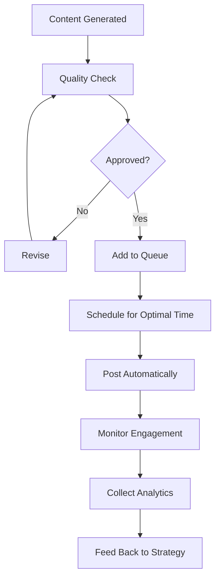
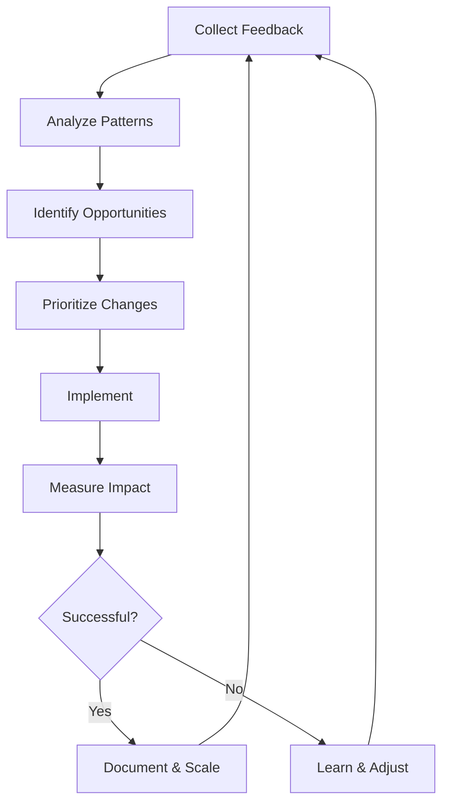
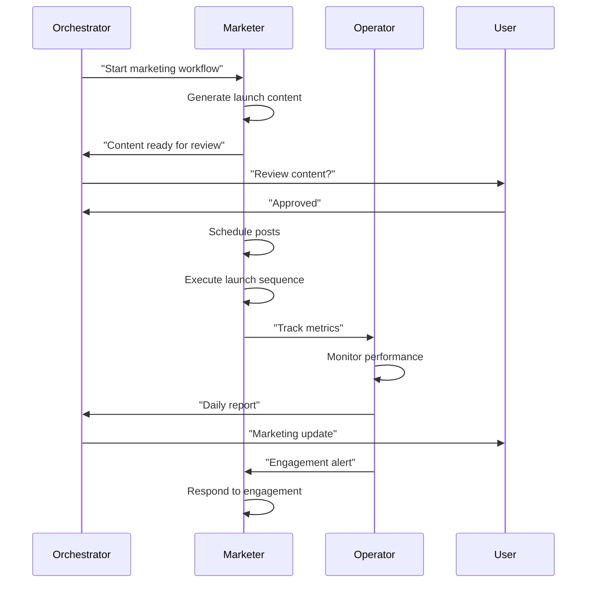

# Market App Workflow
## Complete Guide to Automated Marketing & Launch

**Version**: 4.0
**Duration**: Ongoing (initial setup: 2-4 hours)
**Agents Involved**: Marketer, Operator, Orchestrator

---

## WORKFLOW OVERVIEW

```
┌─────────────────────────────────────────────────────────────────────────┐
│                        MARKET APP WORKFLOW                               │
├─────────────────────────────────────────────────────────────────────────┤
│                                                                          │
│  LAUNCH PREP              LAUNCH DAY            POST-LAUNCH              │
│  ┌─────────────┐          ┌─────────────┐       ┌─────────────┐         │
│  │ Pre-Launch  │ ───────> │  Launch     │ ────> │  Growth     │         │
│  │ Checklist   │          │  Sequence   │       │  Engine     │         │
│  └─────────────┘          └─────────────┘       └─────────────┘         │
│   1-2 days                 24 hours              Ongoing                 │
│                                                                          │
│  CONTINUOUS ACTIVITIES:                                                  │
│  ┌─────────────────────────────────────────────────────────────────┐   │
│  │  Content    │  Social     │  SEO        │  Email       │  Analyze │   │
│  │  Generation │  Posting    │  Optimization│  Sequences  │  Iterate │   │
│  └─────────────────────────────────────────────────────────────────┘   │
│                                                                          │
└─────────────────────────────────────────────────────────────────────────┘
```

---

## PREREQUISITES

### From Deploy Workflow

```yaml
required_from_deploy:
  - production_url: "https://yourdomain.com"
  - app_name: "App Name"
  - app_description: "One-sentence description"
  - target_audience: "From validation phase"
  - pricing: "Price points"
  - key_features: "Top 3-5 features"
  - screenshots: "App screenshots (generated or captured)"
```

### Required Accounts

```yaml
marketing_accounts:
  required:
    - name: "Twitter/X"
      purpose: "Primary social channel for tech"
      url: "https://twitter.com"

    - name: "ProductHunt"
      purpose: "Launch platform"
      url: "https://producthunt.com"
      note: "Account should be 1+ week old before posting"

  recommended:
    - name: "LinkedIn"
      purpose: "B2B marketing"
      url: "https://linkedin.com"

    - name: "Reddit"
      purpose: "Community engagement"
      url: "https://reddit.com"
      note: "Account needs karma before posting"

    - name: "Resend"
      purpose: "Email marketing"
      url: "https://resend.com"

  optional:
    - name: "Hacker News"
      url: "https://news.ycombinator.com"
    - name: "IndieHackers"
      url: "https://indiehackers.com"
    - name: "Dev.to"
      url: "https://dev.to"
```

### Content Generation Tools

```yaml
content_tools:
  text:
    - name: "GLM-4.5"
      cost: "$0.63/1M tokens"
      use_for: "Long-form content, blog posts"

    - name: "Grok 4"
      cost: "$3.15/1M tokens"
      use_for: "Twitter content, real-time data"

  images:
    - name: "Gemini 3 Pro Image"
      cost: "$0.039/image"
      use_for: "Marketing images, social graphics"

  video:
    - name: "Gemini Veo"
      cost: "$0.50/5-sec"
      use_for: "Product demos, social clips"
```

---

## PRE-LAUNCH CHECKLIST
**Duration**: 1-2 days before launch
**Agent**: Marketer (content_writer subagent)

### Asset Preparation

```yaml
required_assets:
  branding:
    - logo: "Square logo (512x512)"
    - logo_text: "Logo with app name"
    - icon: "App icon (multiple sizes)"
    - color_palette: "Primary, secondary, accent"

  screenshots:
    - landing_hero: "1920x1080 hero image"
    - dashboard: "App dashboard screenshot"
    - feature_1: "Key feature screenshot"
    - feature_2: "Secondary feature screenshot"
    - mobile: "Mobile view screenshot"

  copy:
    - tagline: "5-10 word hook"
    - description_short: "1 sentence (50 chars)"
    - description_medium: "2-3 sentences (150 chars)"
    - description_long: "Full paragraph (300 chars)"

  social_profiles:
    - twitter_bio: "160 chars max"
    - linkedin_headline: "Professional angle"
    - producthunt_tagline: "60 chars max"
```

### Screenshot Generation

```python
# Using Gemini for marketing images
async def generate_marketing_image(prompt, style="modern"):
    styles = {
        "modern": "Clean, minimal, gradient background, professional",
        "bold": "Vibrant colors, dynamic angles, energetic",
        "premium": "Dark theme, subtle shadows, luxurious feel"
    }

    full_prompt = f"""
    Create a marketing image for a SaaS application:
    {prompt}

    Style: {styles[style]}
    Dimensions: 1920x1080
    Include: Clean typography, professional feel
    Avoid: Stock photo look, generic clipart
    """

    response = await gemini_generate_image(full_prompt)
    return response.image_url
```

### Copy Templates

```yaml
copy_templates:
  tagline_formulas:
    - "[Action] your [thing] in [time]"
    - "The [adjective] way to [benefit]"
    - "[Problem]? [Solution]."
    - "From [pain] to [gain]"

  description_template: |
    {App Name} helps {target audience} {achieve benefit}
    by {key mechanism}. Unlike {alternative}, we {differentiation}.

  feature_bullets:
    format: "[Emoji] [Feature Name] - [One-sentence benefit]"
    examples:
      - "Lightning-fast [action] - Save hours every week"
      - "Smart [feature] - Let AI do the heavy lifting"
      - "Seamless [integration] - Works with tools you already use"
```

### Pre-Launch Content Queue

```yaml
content_queue:
  blog_posts:
    - title: "Introducing {App Name}: {Tagline}"
      purpose: "Launch announcement"
      seo_keywords: ["{app type}", "{problem}", "{solution}"]

    - title: "Why We Built {App Name}"
      purpose: "Story/founder narrative"
      seo_keywords: ["startup story", "{problem}"]

    - title: "How to {Achieve Main Benefit} with {App Name}"
      purpose: "Tutorial/use case"
      seo_keywords: ["how to {benefit}", "{app type} tutorial"]

  social_posts:
    - twitter_thread: "The problem we're solving"
    - linkedin_post: "Announcing {App Name}"
    - reddit_post: "Show HN/IH: {App Name}"
```

---

## LAUNCH DAY ACTIVITIES
**Duration**: 24 hours
**Agent**: Marketer (social_poster subagent), Orchestrator

### Launch Sequence Timeline

```mermaid
gantt
    title Launch Day Timeline
    dateFormat HH:mm
    axisFormat %H:%M

    section Morning
    ProductHunt submission    :06:00, 30m
    Twitter announcement      :06:30, 15m
    LinkedIn post             :07:00, 15m
    Email to list             :08:00, 30m

    section Midday
    Reddit post               :10:00, 30m
    Engage PH comments        :10:30, 2h
    Twitter follow-up         :12:00, 15m

    section Afternoon
    Hacker News (if ready)    :14:00, 30m
    Indie Hackers post        :15:00, 30m
    Continue engagement       :15:30, 3h

    section Evening
    Progress update tweet     :18:00, 15m
    Thank supporters          :20:00, 30m
    Day summary               :22:00, 30m
```



### ProductHunt Launch Guide

```yaml
producthunt_launch:
  timing:
    submit: "12:01 AM PT (voting resets)"
    best_day: "Tuesday, Wednesday, Thursday"
    avoid: "Friday, weekend, holidays"

  preparation:
    hunter:
      option_1: "Self-hunt (easier, less reach)"
      option_2: "Get a hunter (more credibility)"
      how_to_find: "Twitter, PH community, friends"

    listing:
      name: "{App Name}"
      tagline: "60 chars max, hook + benefit"
      description: "Paragraph explaining the product"
      first_comment: "Story behind the product"
      media:
        - thumbnail: "240x240 logo"
        - gallery: "3-5 images/GIFs"
        - video: "Optional demo video"

  launch_day_actions:
    before_launch:
      - "Prepare first comment draft"
      - "Have team ready to upvote (ethically)"
      - "Prepare responses to common questions"

    during_launch:
      - "Respond to every comment within 1 hour"
      - "Share on social every 3-4 hours"
      - "Thank supporters personally"

    engagement_rules:
      - "NEVER ask for upvotes directly"
      - "Share genuine updates"
      - "Engage authentically"
      - "Offer launch discounts if appropriate"
```

### Social Media Launch Posts

```yaml
twitter_launch:
  announcement_thread:
    tweet_1: |
      Launching today: {App Name}

      {Problem statement in 1 line}

      {Solution in 1 line}

      Here's the story [thread]
    tweet_2: |
      The problem:

      {2-3 sentences about the pain point}

      We've all been there.
    tweet_3: |
      The solution:

      {App Name} does {core feature} so you can {benefit}.

      [Screenshot]
    tweet_4: |
      Key features:

      {Emoji} {Feature 1}
      {Emoji} {Feature 2}
      {Emoji} {Feature 3}

      And it's just ${price}/mo.
    tweet_5: |
      We're live on ProductHunt today!

      Would mean the world if you check it out:
      [PH Link]

      Any feedback appreciated

  follow_up_tweets:
    hour_4: "We're #{X} on ProductHunt right now. Thank you for the support!"
    hour_8: "Amazing feedback coming in. Here's what people are saying..."
    hour_12: "Halfway through launch day. Here's what we've learned..."
    end_of_day: "What a day. Thank you to everyone who supported us."

linkedin_launch:
  post: |
    Excited to announce: {App Name} is live.

    After {X weeks/months} of building, we're launching a tool that helps
    {target audience} {achieve benefit}.

    The problem we saw:
    {Problem description}

    Our approach:
    {Solution description}

    Key features:
    - {Feature 1}
    - {Feature 2}
    - {Feature 3}

    Check it out: {URL}

    Would love your feedback.

    #launch #saas #startup #buildinpublic
```

### Email Launch Announcement

```yaml
email_launch:
  subject_options:
    - "{App Name} is live"
    - "We built something for you"
    - "Finally: {solution to problem}"

  body_template: |
    Hi {first_name},

    Big news: {App Name} is officially live!

    {1-2 sentences about what it does}

    Here's what you get:
    - {Feature 1}: {benefit}
    - {Feature 2}: {benefit}
    - {Feature 3}: {benefit}

    [CTA: Try {App Name} Free]

    Launch special: {offer if any}

    Thanks for being part of this journey.

    {signature}

    P.S. We're on ProductHunt today. If you have 2 seconds, we'd love your support:
    {PH link}

  timing:
    send_time: "8-10 AM recipient timezone"
    follow_up: "Day 2 for non-openers"
```

---

## CONTENT GENERATION WORKFLOW
**Duration**: Ongoing (automated)
**Agent**: Marketer (content_writer, seo_optimizer subagents)

### Blog Post Generation

```python
# blog_generator.py
async def generate_blog_post(topic, app_context, seo_keywords):
    """
    Generate SEO-optimized blog post.
    Uses GLM-4.5 for cost efficiency.
    """

    # Step 1: Research current info
    research = await grok_search(topic, recency="6 months")

    # Step 2: Generate outline
    outline = await glm_chat(f"""
    Create a blog post outline for: {topic}

    Target keywords: {', '.join(seo_keywords)}
    Word count target: 1500-2000

    Include:
    - SEO-optimized title (include primary keyword)
    - Meta description (155 chars)
    - 5-7 H2 sections
    - Key points for each section
    - Where to mention {app_context['name']} naturally
    """)

    # Step 3: Write full post
    post = await glm_chat(f"""
    Write the full blog post based on:
    {outline}

    Research to incorporate:
    {research}

    Product context (weave in naturally, not salesy):
    {app_context}

    Requirements:
    - Conversational but authoritative tone
    - Include keywords naturally
    - Add [INTERNAL_LINK: topic] placeholders
    - 1 CTA per 500 words
    - Actionable takeaways
    """)

    # Step 4: Generate meta
    meta = await glm_chat(f"""
    Generate for this blog post:
    1. SEO title (60 chars max)
    2. Meta description (155 chars)
    3. URL slug (lowercase, hyphens)
    4. 5 related keywords

    Post: {post[:500]}
    """)

    return {
        "content": post,
        "meta": meta,
        "keywords": seo_keywords,
        "word_count": len(post.split())
    }
```

### Social Content Generation

```python
# social_generator.py
async def generate_social_content(topic, platform, style):
    """
    Generate platform-specific social content.
    """

    platform_configs = {
        "twitter": {
            "model": "grok",
            "max_length": 280,
            "tone": "Conversational, punchy",
            "format": "Short sentences, line breaks"
        },
        "linkedin": {
            "model": "glm",
            "max_length": 3000,
            "tone": "Professional but personal",
            "format": "Hook + story + insight + CTA"
        },
        "reddit": {
            "model": "glm",
            "max_length": 10000,
            "tone": "Community member, helpful",
            "format": "Value-first, minimal self-promotion"
        }
    }

    config = platform_configs[platform]

    styles = {
        "educational": "Teach something useful",
        "story": "Share a personal experience",
        "controversial": "Challenge common belief",
        "question": "Engage with a thought-provoking question",
        "behind_scenes": "Show the building process"
    }

    prompt = f"""
    Create a {platform} post about: {topic}

    Style: {styles[style]}
    Tone: {config['tone']}
    Format: {config['format']}
    Max length: {config['max_length']} chars

    Make it feel authentic, not like marketing.
    """

    if config['model'] == 'grok':
        content = await grok_chat(prompt)
    else:
        content = await glm_chat(prompt)

    return {
        "content": content,
        "platform": platform,
        "style": style,
        "character_count": len(content)
    }
```

### Content Calendar Template

```yaml
weekly_content_calendar:
  monday:
    - platform: "twitter"
      type: "thread"
      topic: "Educational content"
      time: "9:00 AM"
    - platform: "linkedin"
      type: "post"
      topic: "Industry insight"
      time: "10:00 AM"

  tuesday:
    - platform: "twitter"
      type: "single"
      topic: "Quick tip"
      time: "12:00 PM"
    - platform: "blog"
      type: "draft"
      topic: "Start weekly article"

  wednesday:
    - platform: "twitter"
      type: "single"
      topic: "Feature highlight"
      time: "2:00 PM"
    - platform: "email"
      type: "draft"
      topic: "Newsletter prep"

  thursday:
    - platform: "twitter"
      type: "thread"
      topic: "Results/case study"
      time: "9:00 AM"
    - platform: "linkedin"
      type: "post"
      topic: "Thought leadership"
      time: "10:00 AM"
    - platform: "blog"
      type: "publish"
      topic: "Weekly article"

  friday:
    - platform: "twitter"
      type: "single"
      topic: "Weekend reading"
      time: "11:00 AM"
    - platform: "email"
      type: "send"
      topic: "Newsletter"
      time: "10:00 AM"

  saturday:
    - type: "analysis"
      action: "Review week's performance"

  sunday:
    - type: "planning"
      action: "Queue next week's content"
```

---

## SOCIAL MEDIA POSTING SCHEDULE
**Agent**: Marketer (social_poster subagent)

### Optimal Posting Times

```yaml
optimal_times:
  twitter:
    weekdays: ["8:00 AM", "12:00 PM", "5:00 PM"]
    weekends: ["10:00 AM", "2:00 PM"]
    best_days: ["Tuesday", "Wednesday", "Thursday"]
    timezone: "Audience timezone (usually EST)"

  linkedin:
    weekdays: ["7:30 AM", "12:00 PM", "5:30 PM"]
    weekends: "Not recommended"
    best_days: ["Tuesday", "Wednesday", "Thursday"]
    timezone: "EST"

  reddit:
    optimal: ["8-10 AM EST"]
    note: "Post when US wakes up"
    best_days: ["Monday", "Tuesday", "Wednesday"]

  producthunt:
    launch: "12:01 AM PT"
    best_days: ["Tuesday", "Wednesday", "Thursday"]

  email:
    b2b: ["Tuesday 10 AM", "Thursday 10 AM"]
    b2c: ["Tuesday 10 AM", "Saturday 10 AM"]
```

### Automated Posting Flow



### Platform-Specific Guidelines

```yaml
twitter_guidelines:
  do:
    - "Use 1-2 emojis per tweet"
    - "Include images when possible"
    - "Use threads for complex topics"
    - "Engage with replies quickly"
    - "Quote tweet with commentary"
  dont:
    - "Over-use hashtags (max 2)"
    - "Post identical content repeatedly"
    - "Ignore mentions/replies"
    - "Be overly promotional"

linkedin_guidelines:
  do:
    - "Start with a hook (first 2 lines)"
    - "Use line breaks for readability"
    - "Share personal insights"
    - "Tag relevant people/companies"
    - "Engage in comments"
  dont:
    - "Write walls of text"
    - "Use too many hashtags (max 5)"
    - "Be purely promotional"
    - "Cross-post Twitter content directly"

reddit_guidelines:
  do:
    - "Provide value first"
    - "Follow subreddit rules exactly"
    - "Engage authentically"
    - "Be transparent about affiliation"
  dont:
    - "Self-promote without value"
    - "Spam multiple subreddits"
    - "Use marketing speak"
    - "Ignore community feedback"
```

---

## SEO BASICS SETUP
**Duration**: Initial 2-3 hours, then ongoing
**Agent**: Marketer (seo_optimizer subagent)

### Technical SEO Checklist

```yaml
technical_seo:
  basics:
    - [ ] sitemap.xml generated and submitted
    - [ ] robots.txt configured correctly
    - [ ] SSL certificate active
    - [ ] Mobile-friendly (responsive)
    - [ ] Fast loading (< 3s)

  meta_tags:
    - [ ] Unique title tags per page (50-60 chars)
    - [ ] Meta descriptions (150-160 chars)
    - [ ] Open Graph tags for social sharing
    - [ ] Twitter Card tags

  structure:
    - [ ] Clean URL structure
    - [ ] Proper heading hierarchy (H1 > H2 > H3)
    - [ ] Internal linking strategy
    - [ ] Breadcrumbs where appropriate

  performance:
    - [ ] Images optimized (WebP, lazy loading)
    - [ ] Core Web Vitals passing
    - [ ] No broken links
    - [ ] Proper redirects
```

### Next.js SEO Setup

```typescript
// src/app/layout.tsx
import type { Metadata } from 'next';

export const metadata: Metadata = {
  metadataBase: new URL('https://yourdomain.com'),
  title: {
    default: 'App Name - Tagline',
    template: '%s | App Name'
  },
  description: 'Your 150-160 character meta description here.',
  keywords: ['keyword1', 'keyword2', 'keyword3'],
  authors: [{ name: 'Your Name' }],
  creator: 'Your Company',
  openGraph: {
    type: 'website',
    locale: 'en_US',
    url: 'https://yourdomain.com',
    title: 'App Name - Tagline',
    description: 'Your description',
    siteName: 'App Name',
    images: [{
      url: '/og-image.png',
      width: 1200,
      height: 630,
      alt: 'App Name'
    }]
  },
  twitter: {
    card: 'summary_large_image',
    title: 'App Name - Tagline',
    description: 'Your description',
    images: ['/og-image.png'],
    creator: '@yourhandle'
  },
  robots: {
    index: true,
    follow: true,
    googleBot: {
      index: true,
      follow: true,
      'max-video-preview': -1,
      'max-image-preview': 'large',
      'max-snippet': -1
    }
  }
};
```

```typescript
// src/app/sitemap.ts
import { MetadataRoute } from 'next';

export default function sitemap(): MetadataRoute.Sitemap {
  const baseUrl = 'https://yourdomain.com';

  return [
    {
      url: baseUrl,
      lastModified: new Date(),
      changeFrequency: 'weekly',
      priority: 1
    },
    {
      url: `${baseUrl}/features`,
      lastModified: new Date(),
      changeFrequency: 'monthly',
      priority: 0.8
    },
    {
      url: `${baseUrl}/pricing`,
      lastModified: new Date(),
      changeFrequency: 'monthly',
      priority: 0.8
    },
    {
      url: `${baseUrl}/blog`,
      lastModified: new Date(),
      changeFrequency: 'daily',
      priority: 0.7
    }
    // Add more pages dynamically
  ];
}
```

### Keyword Strategy

```yaml
keyword_strategy:
  primary_keywords:
    - "{main problem} software"
    - "{main problem} app"
    - "best {problem} tool"

  secondary_keywords:
    - "how to {solve problem}"
    - "{competitor} alternative"
    - "{problem} for {audience}"

  long_tail_keywords:
    - "best {problem} app for {specific use case}"
    - "how to {action} without {pain point}"
    - "{problem} tool for {specific audience}"

  content_mapping:
    homepage: "primary keywords"
    features: "secondary keywords"
    blog_posts: "long-tail keywords"
    comparison_pages: "competitor alternatives"
```

---

## EMAIL MARKETING SEQUENCES
**Agent**: Marketer (content_writer subagent)

### Welcome Sequence (5 emails)

```yaml
welcome_sequence:
  email_1:
    day: 0
    subject: "Welcome to {App Name}"
    goal: "First impression + quick win"
    content:
      - Welcome message
      - What to expect
      - One quick action to get value immediately
    cta: "Complete your profile"

  email_2:
    day: 1
    subject: "Here's the #1 thing to try first"
    goal: "Core feature adoption"
    content:
      - Focus on killer feature
      - Step-by-step guide
      - Success story/example
    cta: "Try {killer feature}"

  email_3:
    day: 3
    subject: "How {Customer} {achieved result}"
    goal: "Social proof"
    content:
      - Customer success story
      - Specific metrics/results
      - How they did it
    cta: "See more success stories"

  email_4:
    day: 5
    subject: "A hidden feature you might have missed"
    goal: "Feature discovery"
    content:
      - Secondary feature highlight
      - Use case examples
      - Pro tips
    cta: "Explore features"

  email_5:
    day: 7
    subject: "Quick question..."
    goal: "Engagement + feedback"
    content:
      - Check-in on experience
      - Ask for feedback
      - Offer help
    cta: "Reply with thoughts"
```

### Trial Ending Sequence (3 emails)

```yaml
trial_sequence:
  email_1:
    day: -3
    subject: "Your trial ends in 3 days"
    goal: "Awareness + value recap"
    content:
      - Trial ending reminder
      - What they've accomplished
      - What they'll lose access to
    cta: "Upgrade now"

  email_2:
    day: -1
    subject: "Last day to keep your {data/progress}"
    goal: "Urgency"
    content:
      - Final reminder
      - Specific benefits of upgrading
      - Limited-time offer (optional)
    cta: "Don't lose access"

  email_3:
    day: 0
    subject: "Your trial has ended"
    goal: "Final conversion attempt"
    content:
      - Trial expired notice
      - Easy path to reactivate
      - Special offer to come back
    cta: "Reactivate now"
```

### Win-Back Sequence (3 emails)

```yaml
winback_sequence:
  email_1:
    day: 7
    subject: "We miss you at {App Name}"
    goal: "Re-engagement"
    content:
      - Acknowledge they left
      - What's new since they left
      - No pressure, just an update
    cta: "See what's new"

  email_2:
    day: 14
    subject: "A special offer just for you"
    goal: "Incentivize return"
    content:
      - Exclusive discount
      - Limited time
      - Recap of value
    cta: "Claim 30% off"

  email_3:
    day: 30
    subject: "Before we say goodbye..."
    goal: "Final attempt + feedback"
    content:
      - Last chance offer
      - Request for feedback
      - Graceful farewell
    cta: "One more chance" / "Share feedback"
```

### Email Automation Setup

```javascript
// email-automation.js
import { Resend } from 'resend';

const resend = new Resend(process.env.RESEND_API_KEY);

async function sendSequenceEmail(user, sequence, emailNumber) {
  const templates = await getEmailTemplates(sequence);
  const template = templates[emailNumber];

  const personalizedContent = personalizeEmail(template, user);

  await resend.emails.send({
    from: 'App Name <hello@yourdomain.com>',
    to: user.email,
    subject: personalizedContent.subject,
    html: personalizedContent.html
  });

  // Track
  await trackEmailSent(user.id, sequence, emailNumber);
}

// Trigger emails based on events
async function onUserSignup(user) {
  await scheduleSequence(user, 'welcome');
}

async function onTrialStarted(user, trialEndDate) {
  await scheduleSequence(user, 'trial_ending', trialEndDate);
}

async function onChurn(user) {
  await scheduleSequence(user, 'winback');
}
```

---

## ENGAGEMENT MONITORING
**Agent**: Operator (with Marketer)

### Metrics to Track

```yaml
marketing_metrics:
  acquisition:
    - website_traffic: "Daily visitors"
    - traffic_sources: "Where visitors come from"
    - signups: "New registrations"
    - signup_rate: "Visitors to signups"

  engagement:
    - social_followers: "Twitter, LinkedIn"
    - social_engagement: "Likes, comments, shares"
    - email_open_rate: "Target: 20-30%"
    - email_click_rate: "Target: 2-5%"
    - blog_traffic: "Readers per post"

  conversion:
    - trial_starts: "Free trials started"
    - trial_conversion: "Trial to paid %"
    - mrr_from_marketing: "Revenue attributed"

  content:
    - top_performing_posts: "By engagement"
    - content_shares: "Social shares"
    - seo_rankings: "Keyword positions"
```

### Analytics Dashboard

```yaml
marketing_dashboard:
  daily_view:
    - New visitors today
    - New signups today
    - Social mentions
    - Email performance

  weekly_view:
    - Traffic trend
    - Top content
    - Social growth
    - Email sequence performance
    - SEO ranking changes

  monthly_view:
    - MRR growth
    - Customer acquisition cost
    - Channel performance
    - Content ROI
```

### Engagement Response Protocol

```yaml
engagement_protocol:
  twitter_mentions:
    response_time: "< 2 hours"
    positive: "Thank + engage"
    question: "Answer helpfully"
    complaint: "Acknowledge + DM to resolve"
    feature_request: "Thank + log"

  producthunt_comments:
    response_time: "< 1 hour on launch day"
    action: "Respond to every comment"
    tone: "Grateful, helpful"

  reddit_posts:
    response_time: "< 4 hours"
    action: "Provide value, not promotion"
    tone: "Community member"

  email_replies:
    response_time: "< 24 hours"
    action: "Personal response"
    escalate_if: "Bug report, churn risk"
```

---

## PERFORMANCE TRACKING
**Agent**: Operator

### Weekly Marketing Report

```markdown
# Marketing Report: Week of {date}

## Traffic
- Total visitors: {X} ({+/-X%} vs last week)
- Top sources:
  1. {Source 1}: {X} visitors
  2. {Source 2}: {X} visitors
  3. {Source 3}: {X} visitors

## Conversions
- New signups: {X} ({+/-X%})
- Trial starts: {X}
- Conversions: {X}
- Conversion rate: {X%}

## Social
- Twitter: +{X} followers, {X} engagements
- LinkedIn: +{X} followers, {X} engagements
- Top post: "{post}" - {X} engagements

## Email
- Sent: {X}
- Open rate: {X%}
- Click rate: {X%}
- Unsubscribes: {X}

## Content
- Blog posts published: {X}
- Total blog traffic: {X}
- Top post: "{title}" - {X} views

## SEO
- Keywords ranking: {X}
- Position changes: +{X} improved, -{X} dropped
- Top keyword: "{keyword}" - position {X}

## Action Items
1. {Action based on data}
2. {Action based on data}
3. {Action based on data}

---
Generated: {timestamp}
```

### A/B Testing Protocol

```yaml
ab_testing:
  what_to_test:
    landing_page:
      - Headlines
      - CTAs
      - Hero images
      - Social proof placement

    email:
      - Subject lines
      - Send times
      - CTA buttons
      - Personalization

    social:
      - Post formats
      - Posting times
      - Hashtag usage
      - Media types

  process:
    1: "Hypothesis: {X} will increase {metric}"
    2: "Create variants A and B"
    3: "Split audience 50/50"
    4: "Run for statistical significance"
    5: "Analyze results"
    6: "Implement winner"
    7: "Document learnings"

  minimum_sample:
    landing_page: "500 visitors per variant"
    email: "1000 recipients per variant"
    social: "10 posts per variant"
```

---

## ITERATION BASED ON FEEDBACK
**Agent**: Orchestrator + Marketer

### Feedback Collection

```yaml
feedback_sources:
  direct:
    - Customer support tickets
    - Email replies
    - Social comments
    - User interviews

  indirect:
    - Analytics patterns
    - Churn surveys
    - Review sites
    - Social mentions

  automated:
    - NPS surveys (in-app)
    - Feature request voting
    - Usage analytics
```

### Iteration Cycle



### Marketing Playbook Updates

```yaml
playbook_updates:
  weekly:
    - Review content performance
    - Adjust posting schedule
    - Update content queue
    - Refresh underperformers

  monthly:
    - Review channel effectiveness
    - Update keyword strategy
    - Refresh email sequences
    - Update landing page

  quarterly:
    - Full strategy review
    - Competitive analysis
    - Pricing review
    - Major campaign planning
```

---

## AGENT COORDINATION



---

## COMMANDS

| Command | Description |
|---------|-------------|
| `/factory:market` | Start marketing workflow |
| `/factory:market:content {type}` | Generate specific content |
| `/factory:market:schedule` | View/edit content schedule |
| `/factory:market:post {platform}` | Post to specific platform |
| `/factory:market:report` | Generate marketing report |
| `/factory:market:engage` | Check engagement queue |

---

## COST TRACKING

```yaml
marketing_costs:
  content_generation:
    blog_post: "$0.01-0.02"
    twitter_thread: "$0.01"
    email_sequence: "$0.02"
    total_weekly: "$0.15-0.25"

  tools:
    resend: "Free tier: 3k emails/mo"
    posthog: "Free tier: 1M events/mo"
    scheduling: "Free (built-in)"

  ads (optional):
    twitter: "$50-200/week"
    reddit: "$50-100/week"
    google: "$100-500/week"

  total_monthly:
    bootstrap: "$5-20"
    growth: "$100-500"
    scale: "$500-2000+"
```

---

*Market App Workflow v4.0 - From launch to growth*
*Continuous marketing automation with manual oversight*
